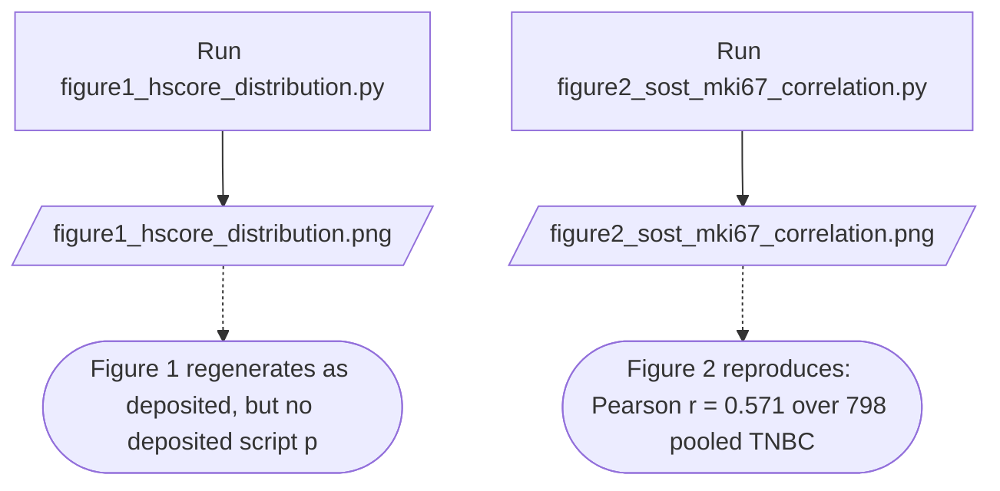

# Analysis graph

Generated 2026-11-14T18:31:53Z by whatran.py/0.4.0. Main path only; rejected branches and unlinked executions are kept in `graph.json`.

```mermaid
flowchart TD
  n0[/"figure1_hscore_distribution.png"/]
  n1["Run figure1_hscore_distribution.py"]
  n2[/"figure2_sost_mki67_correlation.png"/]
  n3["Run figure2_sost_mki67_correlation.py"]
  n4(["Figure 2 reproduces: Pearson r = 0.571 over 798 pooled TNBC "])
  n5(["Figure 1 regenerates as deposited, but no deposited script p"])
  n1 --> n0
  n3 --> n2
  n2 -.-> n4
  n0 -.-> n5
```
